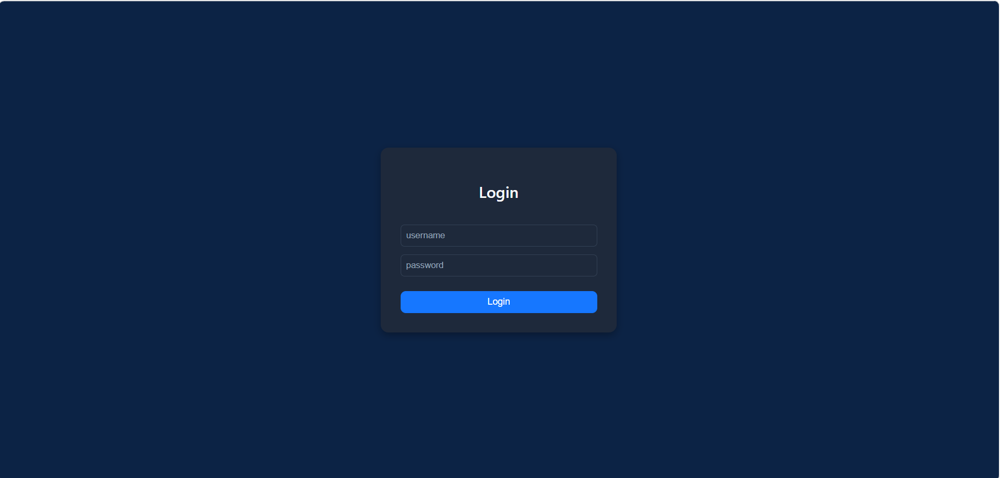
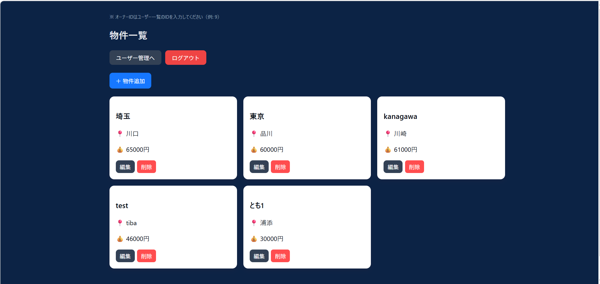
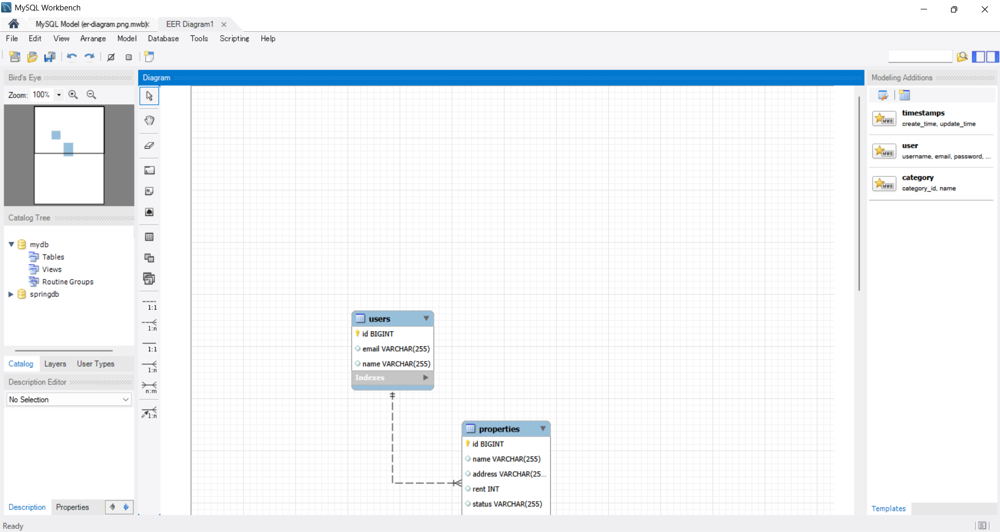

# ユーザー・物件管理アプリ（JWT認証付きフルスタック）

## 🎯 概要

JWT認証付きのフルスタックアプリとして、バックエンドからフロントエンドまで一貫して実装しました。  
ユーザー管理と物件管理を通して、認証・CRUD・API連携の基本を網羅しています。

---

## 🌐 デモ（実際に操作可能）

フロント  
https://user-crud-app-dusky.vercel.app

API（Swagger）  
https://user-management-api-bhn3.onrender.com/swagger-ui/index.html

### 🔑 ログイン情報
username: admin  
password: admin  

---

## 🧪 動作確認手順（面接官向け）

1. 上記URLにアクセス → ログイン画面表示  
2. admin / admin でログイン  
3. ユーザー管理でユーザー作成  
4. 作成したユーザーIDを使って物件作成  
5. CRUD操作を確認  

※ オーナーIDはユーザー一覧のIDを使用してください（例: 1）

---

## 📸 画面イメージ

### ログイン画面

### ユーザー管理

### 物件管理

---

## 🗄 DB設計

ユーザーと物件は1対多の関係となっています。

- 1ユーザーが複数の物件を所有
- properties.owner_id → users.id を参照（外部キー）

## 🧩 システム構成

- Backend：Spring Boot（REST API + JWT認証）
- Frontend：React（Vite）
- Infrastructure：Render / Vercel

---

## 🛠 使用技術

### Backend
- Java 17
- Spring Boot
- Spring Security
- JWT認証
- Spring Data JPA
- MySQL
- Maven
- Jakarta Validation

### Frontend
- React（Vite）
- Axios
- React Router

---

## 🏗 アーキテクチャ

Controller  
↓  
Service  
↓  
Repository  
↓  
Entity（DB）

---

## ⚙ Backend構成

- Spring SecurityによるJWT認証
- DTOでEntityと分離
- GlobalExceptionHandlerでエラーハンドリング統一
- JPAでDB操作

---

## 📡 API確認

Swagger UIでAPIの動作確認が可能です  
https://user-management-api-bhn3.onrender.com/swagger-ui/index.html  

※ フロントを使わずAPI単体でも確認できます

---

## 🔐 認証（JWT）

- `/auth/login` でトークン発行
- JWTをヘッダーに付与してAPI通信
- `/auth/**` は認証不要
- その他APIは認証必須

---

## 💻 フロント設計

- Axios interceptorでJWT自動付与
- 401エラー時にログイン画面へリダイレクト
- React Routerで認証ガードを実装

---

## 📌 機能

### 認証
- ログイン（JWT）

### ユーザー管理
- CRUD
- 検索
- ページング

### 物件管理
- CRUD（オーナーIDでユーザーと紐付け）

---

## 📡 API一覧

### 認証
POST /auth/login  

### ユーザー
POST /users  
GET /users  
PUT /users/{id}  
DELETE /users/{id}  

### 物件
POST /properties  
GET /properties  
PUT /properties/{id}  
DELETE /properties/{id}  

---

## 🧪 テスト

- Controllerの単体テストを実装
- MockMvc + Mockito を使用し、Service層をモック化して検証

---

## 💡 工夫した点

- JWT認証によるセキュアなAPI設計
- DTOを用いてEntityを外部に公開しない構成
- GlobalExceptionHandlerによるエラーハンドリング統一
- フロント/バックの分離構成
- Axios interceptorでトークン自動付与
- デプロイ環境（Render / Vercel）の構築

---

## ⚠ 苦労した点

- JWT認証の仕組み理解
- CORSエラー対応
- デプロイ時のAPI接続（環境差異）

---

## 🚀 今後の改善

- UI/UXの改善
- Service層のテスト追加
- Docker対応

---

## ▶ 起動方法

### Backend
cd backend  
./mvnw spring-boot:run  

### Frontend
cd frontend  
npm install  
npm run dev  